# CimaGen

Static client-side image processing toolkit built with React and Vite, deployed to GitHub Pages. Each route exposes a focused browser tool for image transformation, export, inspection, or generation. The processing pipeline stays in the browser runtime, so there is no application server handling user files.

Live site: [https://motebaya.github.io/cimagen/](https://motebaya.github.io/cimagen/)

## Overview

CimaGen is a route-based single-page application that groups a broad set of browser-local imaging utilities behind a shared UI and export workflow. Files are decoded with standard web APIs, rendered through Canvas or tool-specific pipelines, and exported directly from memory through `Blob` and `ObjectURL` downloads.

The project is intentionally designed around static hosting. It does not depend on a backend image queue, remote render service, or upload-first workflow.

## Features

- Client-side image processing and export with no server-side render pipeline.
- Tool coverage across meme generation, watermarking, OCR, metadata inspection, palette extraction, line-art conversion, upscaling, format conversion, PDF assembly, and logo composition.
- Mixed processing strategies depending on the route: Canvas pixel work, worker-backed transforms, OCR, metadata parsing, ZIP packaging, PDF generation, and browser-side model inference.
- Export targets including PNG, JPG, WEBP, SVG, TXT, JSON, PDF, ICO, and ZIP.
- Static deployment on GitHub Pages with route-level code splitting.
- Offline-capable usage after the initial application shell and route-specific assets have been cached.

## Tools Showcase

| No | Preview | Tool | Description | Link |
|--- |--------|------|-------------|------|
| 1 |  | Thumbnail Generator | Generate thumbnail images with centered text and colored backgrounds. Perfect for blog posts, social media, and content previews. | [Open](https://motebaya.github.io/cimagen/thumbnail-creator) |
| 2 | 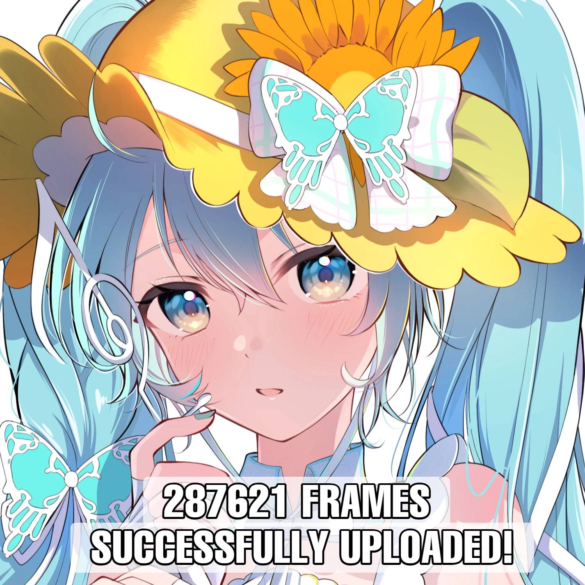 | Statistic Frame Generator | Create statistic overlay frames on background images with customizable text. Great for sharing achievement milestones. | [Open](https://motebaya.github.io/cimagen/statistic-frame-creator) |
| 3 | 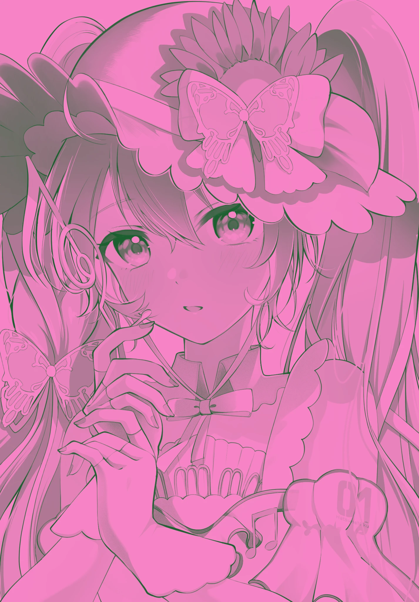 | Duotone Generator | Convert images into a Pink x Green duotone effect. Choose from multiple filter modes including Classic, Reverse, and combined variants. | [Open](https://motebaya.github.io/cimagen/duotone-creator) |
| 4 | 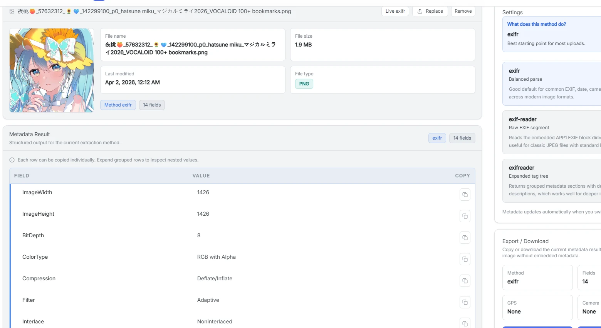 | Metadata Viewer | Extract and view EXIF metadata from images. Check GPS location, camera info, and download cleaned images without metadata. | [Open](https://motebaya.github.io/cimagen/metadata-viewer) |
| 5 | 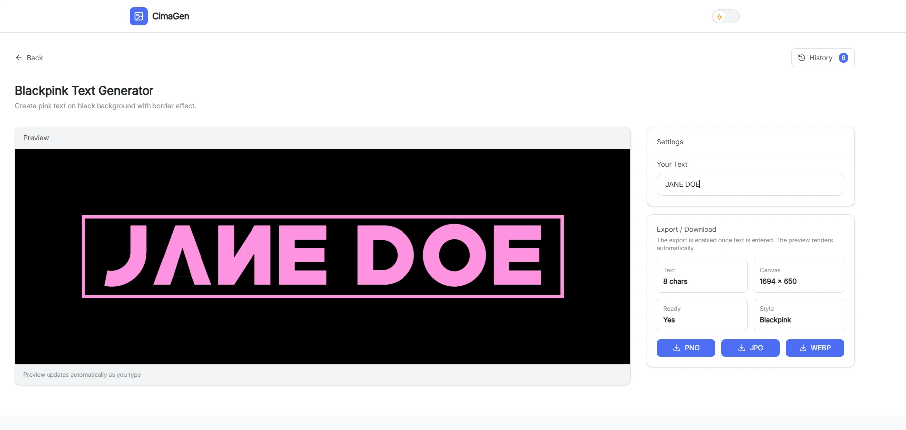 | Blackpink Text | Create pink text on black background with border effect. Perfect for stylish text graphics and social media posts. | [Open](https://motebaya.github.io/cimagen/blackpink-creator) |
| 6 |  | Wasted Generator | Add GTA-style `wasted` overlay to your images. Converts to grayscale and adds the iconic red text effect. | [Open](https://motebaya.github.io/cimagen/wasted-creator) |
| 7 |  | P\*or\*n Hub Logo | Create custom logo with white text, orange box, and rounded image. Parody generator for memes and jokes. | [Open](https://motebaya.github.io/cimagen/phlogo-creator) |
| 8 | 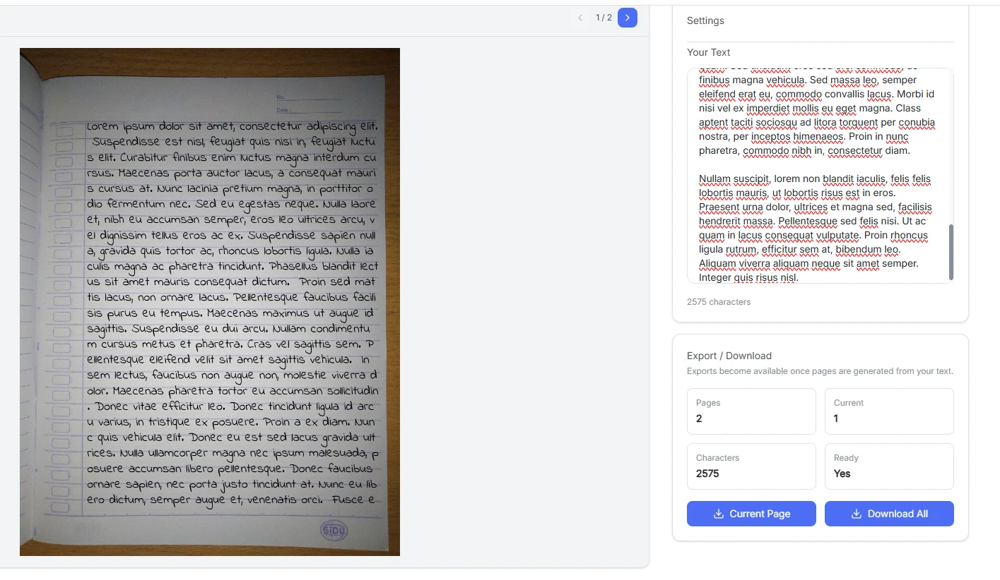 | Paper Writer | Convert text to handwritten-style paper pages. Automatically splits long text into multiple lined paper sheets. | [Open](https://motebaya.github.io/cimagen/paperwriter-creator) |
| 9 | 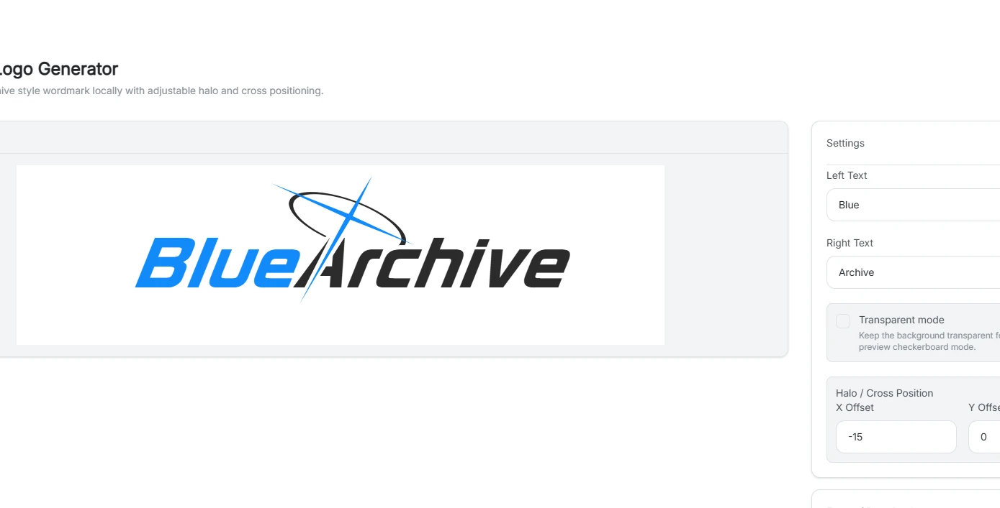 | BlueArchive Logo Generator | Generate Blue Archive style logos locally with editable text, transparent mode, and linked decorative positioning controls. | [Open](https://motebaya.github.io/cimagen/bluearchive-logo) |
| 10 | 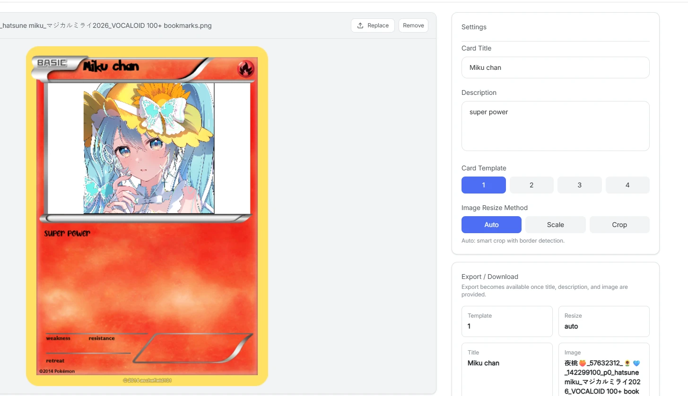 | Pokemon Card | Create custom Pokemon-style trading cards. Choose from 4 templates with smart image cropping and text layout. | [Open](https://motebaya.github.io/cimagen/pokemon-card-creator) |
| 11 | 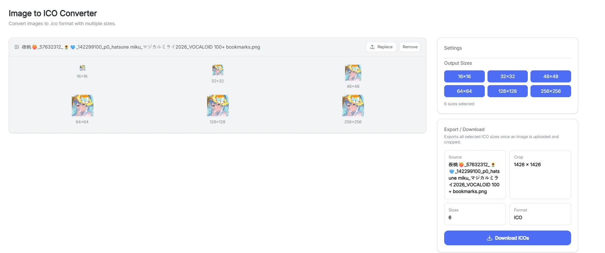 | Image to ICO | Convert images to `.ico` format with multiple sizes. Perfect for creating favicons with automatic square cropping. | [Open](https://motebaya.github.io/cimagen/ico-converter) |
| 12 | 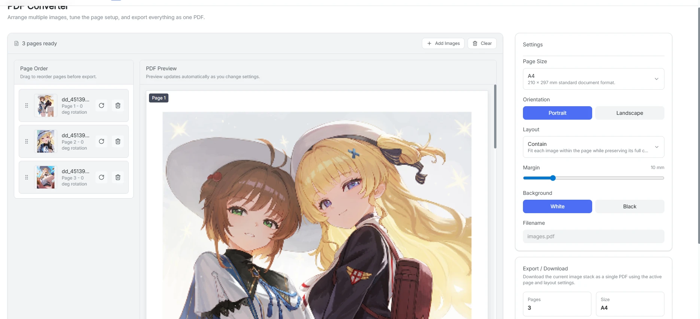 | Image to PDF | Convert multiple images to a single PDF document. Drag to reorder, rotate pages, and customize layout settings. | [Open](https://motebaya.github.io/cimagen/pdf-converter) |
| 13 | 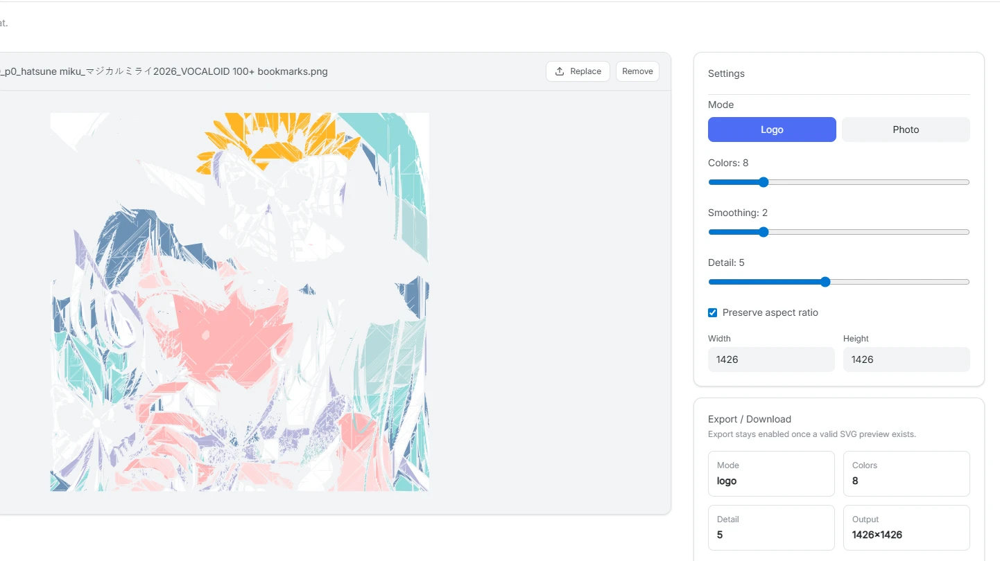 | Image to SVG | Convert raster images to vector SVG format. Choose between Logo mode (clean) or Photo mode (posterized). | [Open](https://motebaya.github.io/cimagen/svg-converter) |
| 14 | 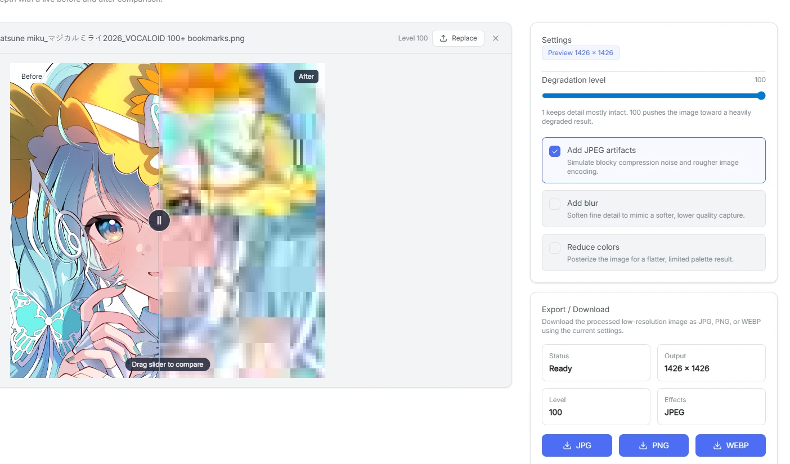 | Low-Res Generator | Simulate realistic low-quality degraded images with JPEG artifacts, blur, and color reduction. Compare before and after. | [Open](https://motebaya.github.io/cimagen/lowres-generator) |
| 15 | 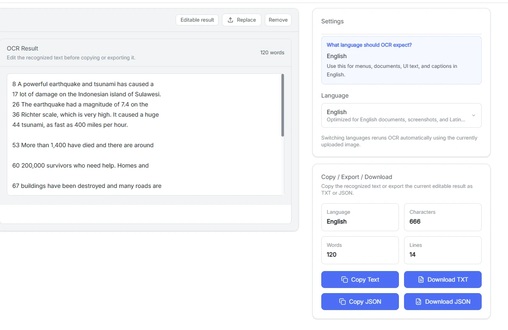 | Image OCR Reader | Extract text from images using optical character recognition. Supports English and Indonesian with preprocessing. | [Open](https://motebaya.github.io/cimagen/ocr-reader) |
| 16 | 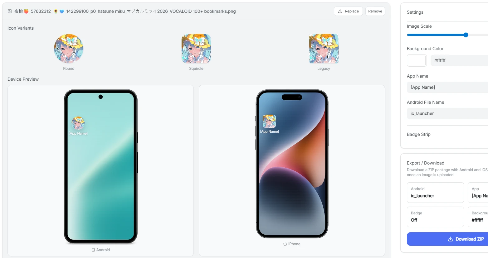 | App Icon Generator | Generate Android and iOS app icons with proper directory structure. Includes adaptive icons, round icons, and all required sizes. | [Open](https://motebaya.github.io/cimagen/app-icon-generator) |
| 17 | 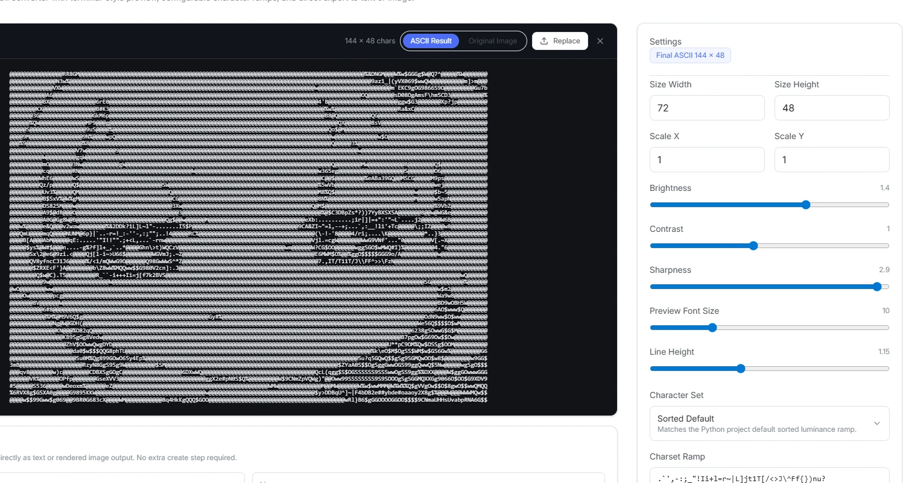 | Image to ASCII | Convert uploaded images into ASCII art with live preview, brightness and contrast controls, custom charsets, and TXT or image export. | [Open](https://motebaya.github.io/cimagen/image-to-ascii) |
| 18 | 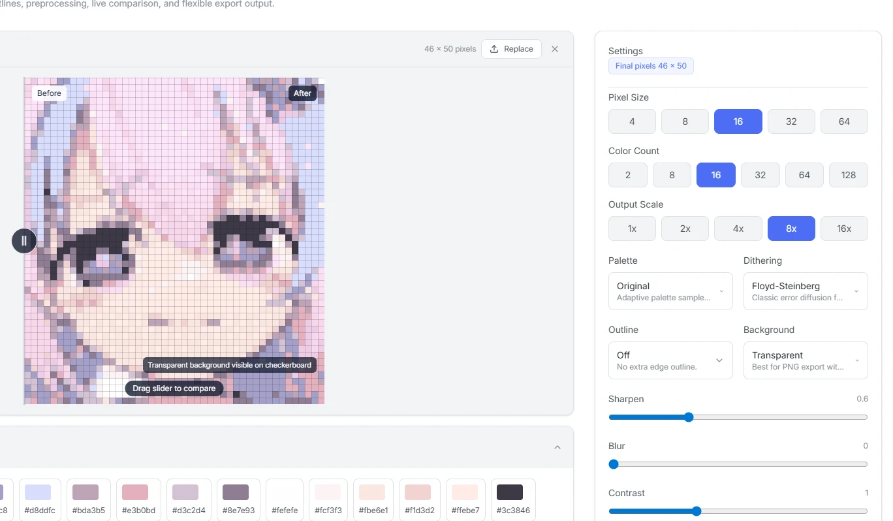 | Image to Pixel | Turn photos into pixel art with palette presets, dithering, outlines, grid overlay, nearest-neighbor scaling, and PNG or SVG export. | [Open](https://motebaya.github.io/cimagen/image-to-pixel) |
| 19 | 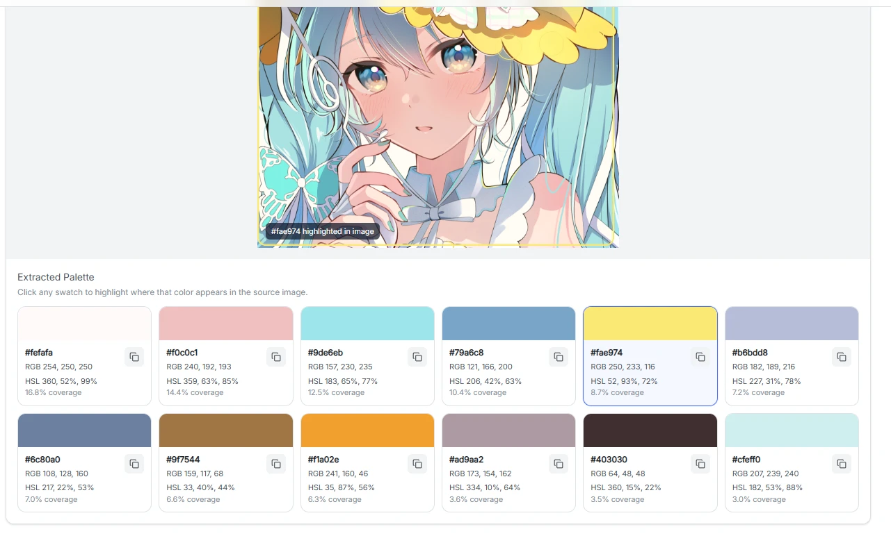 | Color Palette Extractor | Extract dominant colors from images, inspect HEX/RGB/HSL metadata, and export clean palette lists or JSON from a worker-backed pipeline. | [Open](https://motebaya.github.io/cimagen/color-palette-extractor) |
| 20 | 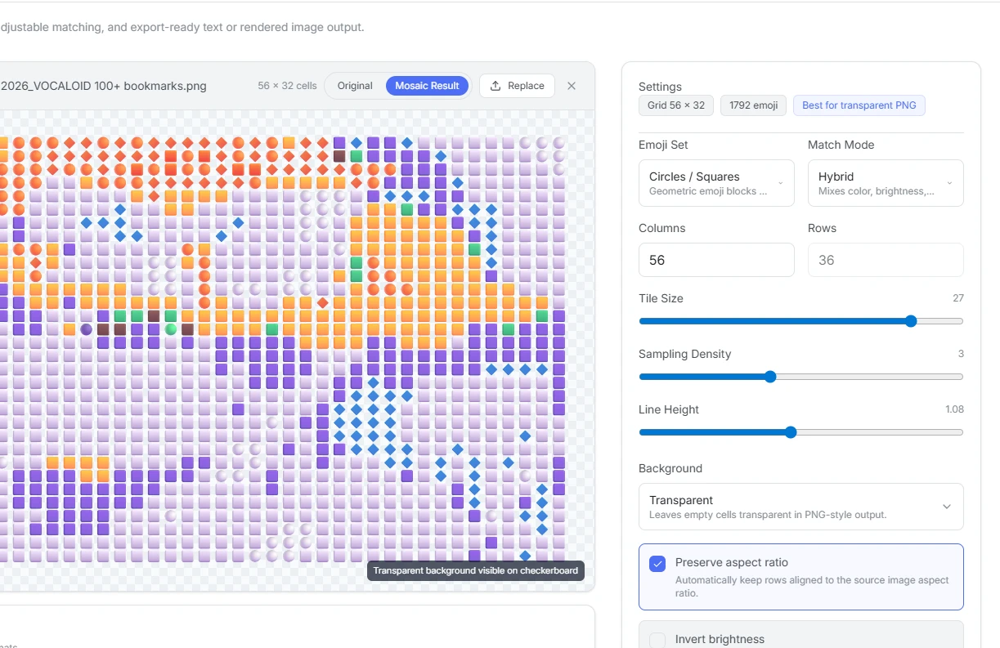 | Image to Emoji Mosaic | Convert images into emoji mosaics with preset libraries, custom emoji sets, grid controls, text export, and rendered image downloads. | [Open](https://motebaya.github.io/cimagen/image-to-emoji-mosaic) |
| 21 | 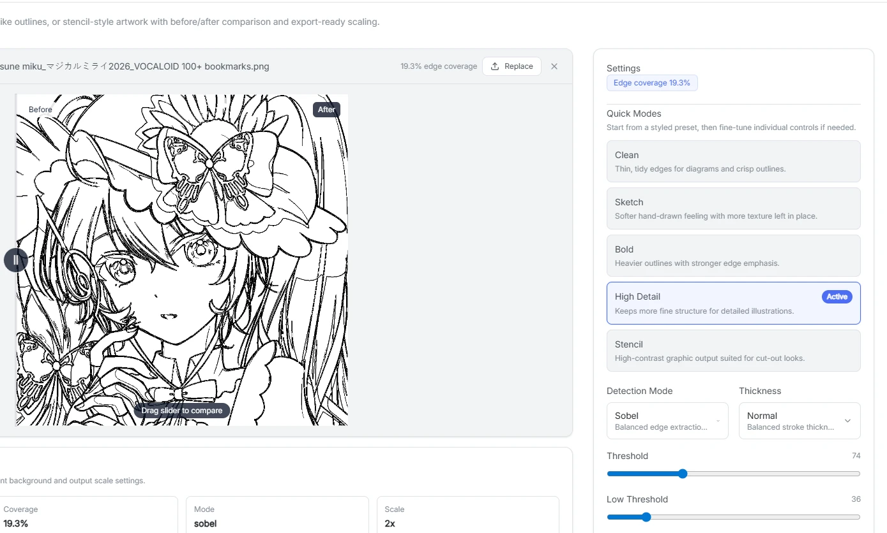 | Image to Line Art | Extract clean edges, sketch-like contours, or stencil-style line art with live threshold tuning, cleanup controls, and high-resolution export. | [Open](https://motebaya.github.io/cimagen/image-to-line-art) |
| 22 | 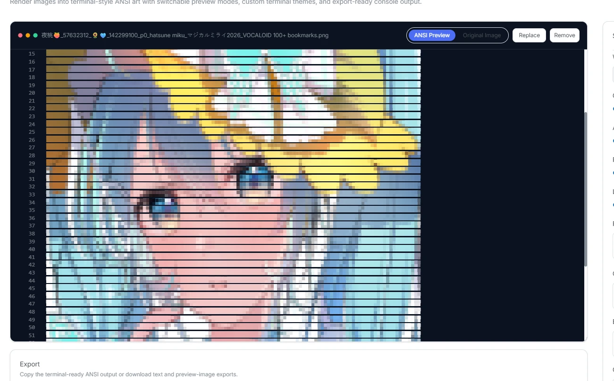 | Image to ANSI Art | Render images into terminal-ready ANSI blocks with truecolor, 256-color, grayscale, or monochrome modes plus copyable console output. | [Open](https://motebaya.github.io/cimagen/image-to-ansi-art) |
| 23 | 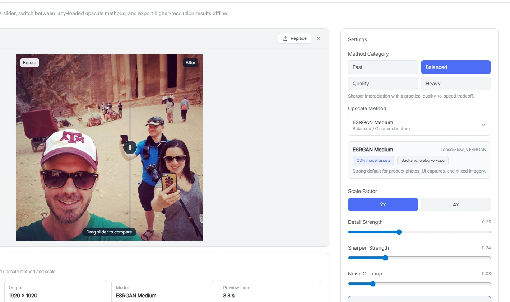 | Image Upscaler | Upscale images offline with classic interpolation or an enhanced detail recovery mode while keeping preview rendering lightweight. | [Open](https://motebaya.github.io/cimagen/image-upscaler) |
| 24 | 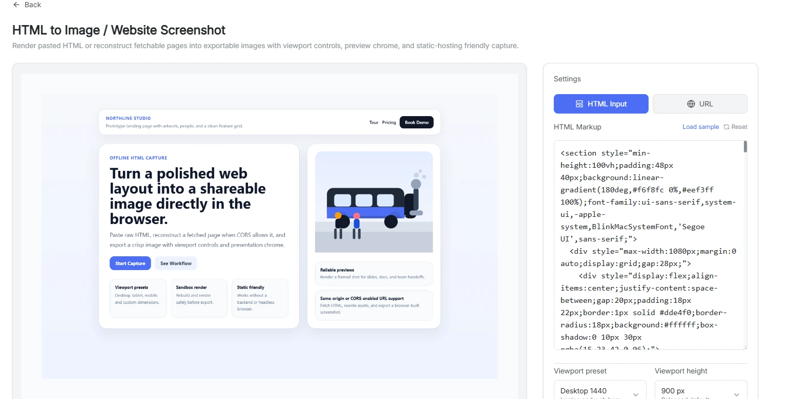 | HTML to Image | Render pasted HTML or same-origin pages into exportable screenshots with viewport presets, device framing, padding, and shadow. | [Open](https://motebaya.github.io/cimagen/html-to-image) |
| 25 | 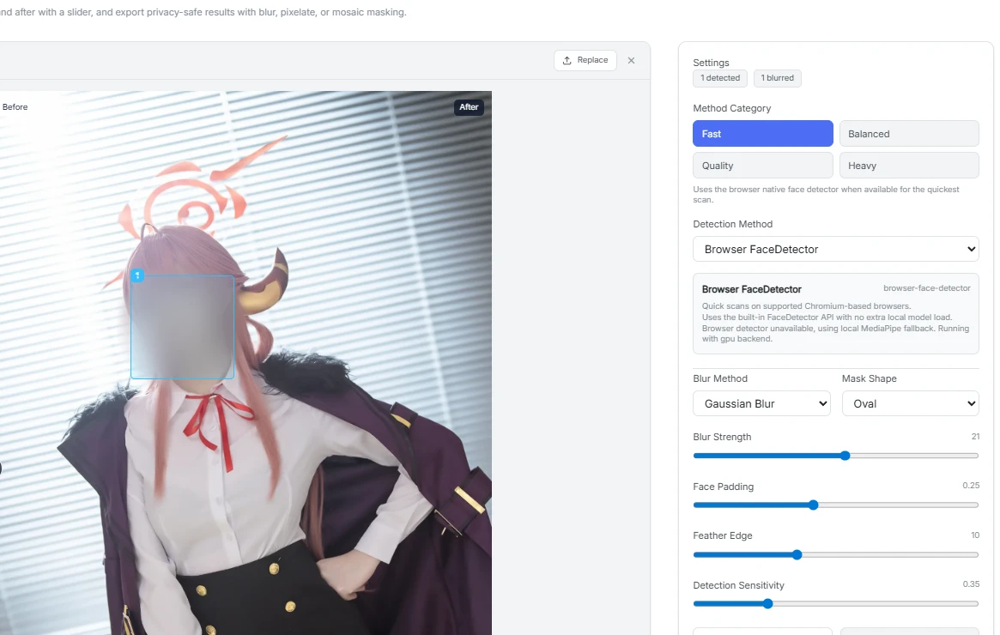 | Face Blur Tool | Detect faces offline, click which regions stay blurred, and export image-safe results with blur, pixelate, or mosaic masking. | [Open](https://motebaya.github.io/cimagen/face-blur) |
| 26 | 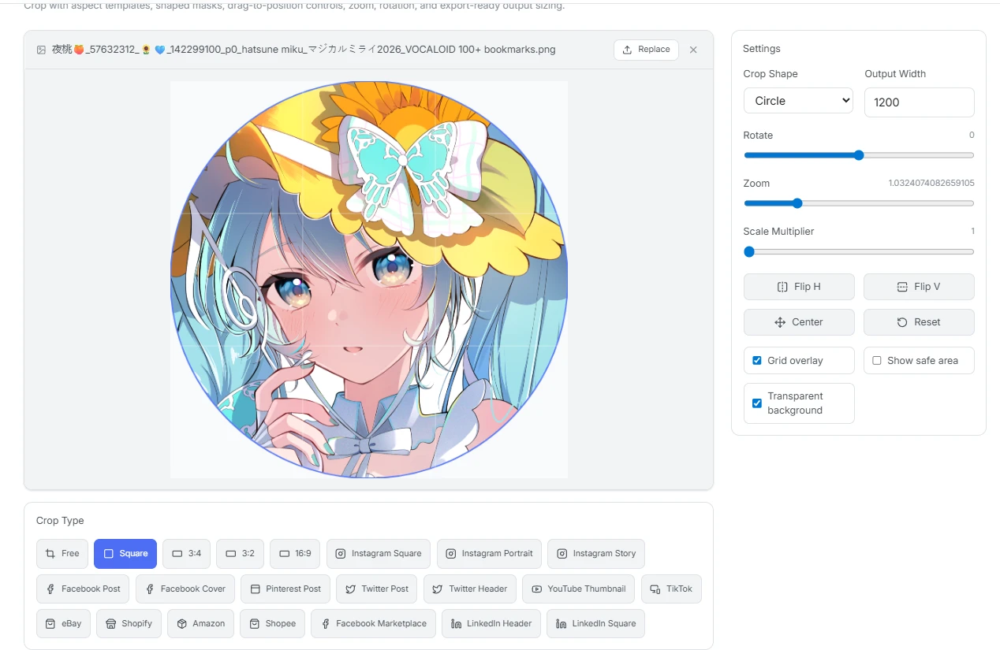 | Advanced Cropper | Crop with aspect templates, shaped masks, zoom, rotation, drag repositioning, and export-ready background options. | [Open](https://motebaya.github.io/cimagen/advanced-cropper) |
| 27 | 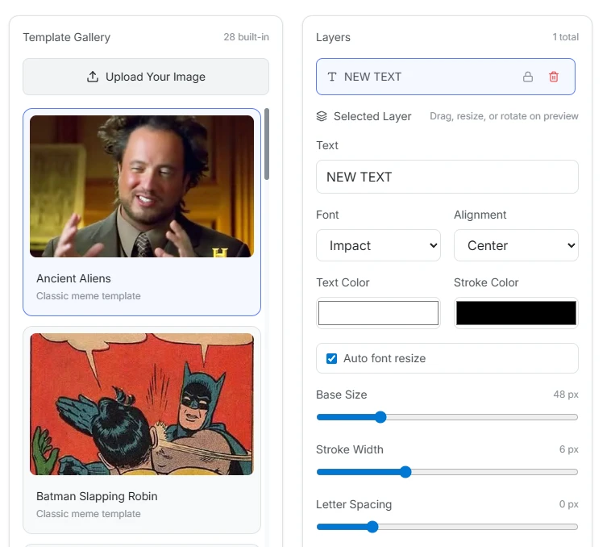 | Meme Generator | Choose a classic meme template, add draggable text or sticker layers, auto-fit captions, and export your finished meme offline. | [Open](https://motebaya.github.io/cimagen/meme-generator) |
| 28 | 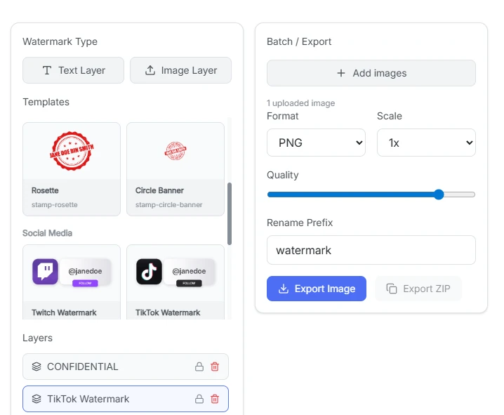 | Watermark Tool | Apply text, image, tiled, and template watermarks with drag controls, layer editing, and batch ZIP export in a wider editor layout. | [Open](https://motebaya.github.io/cimagen/watermark-tool) |
| 29 | 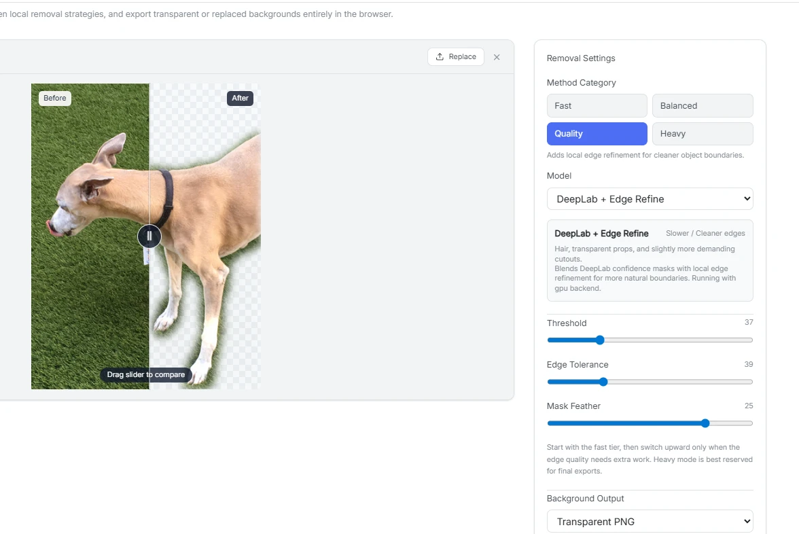 | Background Remover | Remove image backgrounds offline with a worker-based segmentation pipeline, then export transparent or replaced-background versions. | [Open](https://motebaya.github.io/cimagen/background-remover) |

## How It Works

The application is a static SPA served from GitHub Pages. A typical processing path looks like this:

1. The user selects or drops files into a tool route.
2. Files are decoded locally with browser APIs such as `FileReader`, `Image`, `Canvas`, `Blob`, and `ObjectURL`.
3. Tool-specific logic runs entirely in the client. Depending on the route, that can mean direct pixel transforms on Canvas, OCR through `tesseract.js`, metadata parsing through `exifr` and `exifreader`, PDF assembly through `jsPDF`, ZIP packaging through `JSZip`, or browser-side vision and model inference.
4. Results are rendered in the page and exported from memory without sending the original image to a remote server.

There is no server-side image pipeline. The only required network activity is the initial application load and any route-specific static assets or model files that have not been cached yet.

## Tech Stack

| Layer | Implementation |
|------|----------------|
| Application runtime | React 19, React Router, Vite 7 |
| Styling | Tailwind CSS v4, CSS variables, component-level utility classes |
| Imaging pipeline | Canvas API, Blob/ObjectURL APIs, FileReader, FontFace API |
| Text and logo rendering | Canvas 2D text metrics, custom font loading, sliced WOFF2 font sets |
| OCR | Tesseract.js |
| Metadata | exifr, exif-reader, exifreader |
| Vision and ML features | MediaPipe Tasks Vision, TensorFlow.js, browser-side upscaler models |
| Export formats | jsPDF, JSZip, canvas-based PNG/JPEG/WebP output, TXT/JSON downloads |
| Mapping | Leaflet, React Leaflet |
| Deployment | GitHub Pages |

## Performance and Offline Notes

- Images are processed in memory inside the browser process. The app does not upload user files to an external service.
- Heavier tools use route-level lazy loading, so large dependencies are not loaded on every page visit.
- Some workflows rely on worker-backed processing or model assets. The first run can take longer because the browser needs to fetch and cache those assets.
- After the app bundle and tool-specific assets are cached, the tools are usable offline as long as the browser cache remains available.
- Export speed and memory usage depend on image dimensions, number of layers or pages, model weight, and the selected route.

## Development Notes

Run the project locally with:

```bash
npm install
npm run dev
```

Build the production bundle with:

```bash
npm run build
npm run preview
```

Notes:

- The production deployment targets GitHub Pages under the `/cimagen/` base path.
- Tool metadata used by the homepage lives in `src/content/tools.js`.
- Static SEO pages are generated during the build with `scripts/generateSEO.js`.
- Most tools are organized as feature modules with page-level composition and supporting hooks, components, and utilities.

## License

MIT
