# CimaGen - Client-Side Image Generator

A comprehensive web application for client-side image processing and generation. All rendering and transformations run entirely in the browser using the native Canvas API — no server uploads, no external dependencies for image manipulation.

**Live Demo:** [https://motebaya.github.io/cimagen](https://motebaya.github.io/cimagen)

---

## 🎨 Features Overview

CimaGen provides 16 powerful image processing tools, all running locally in your browser for maximum privacy and speed.

### Feature Showcase

| Tool | Preview | Description | Try It |
|------|---------|-------------|--------|
| **Thumbnail Generator** | 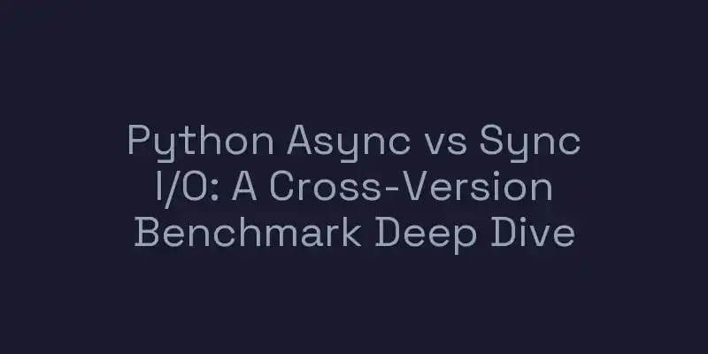 | Generate eye-catching thumbnails (800×400) with centered text and customizable backgrounds. Perfect for YouTube, blogs, and social media. | [Launch →](https://motebaya.github.io/cimagen/thumbnail-creator) |
| **Statistic Frame Creator** | 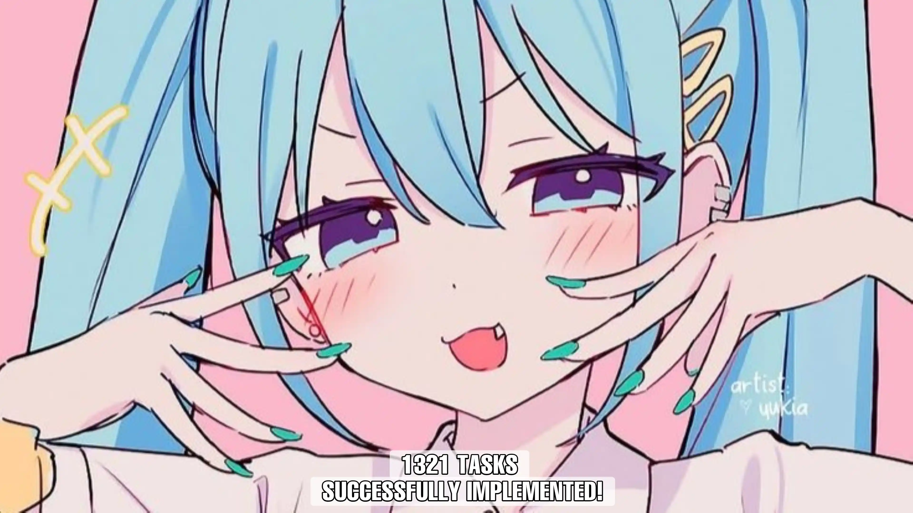 | Overlay statistics and data onto images with semi-transparent backgrounds. Ideal for infographics and data visualization. | [Launch →](https://motebaya.github.io/cimagen/statistic-frame-creator) |
| **Duotone Creator** | 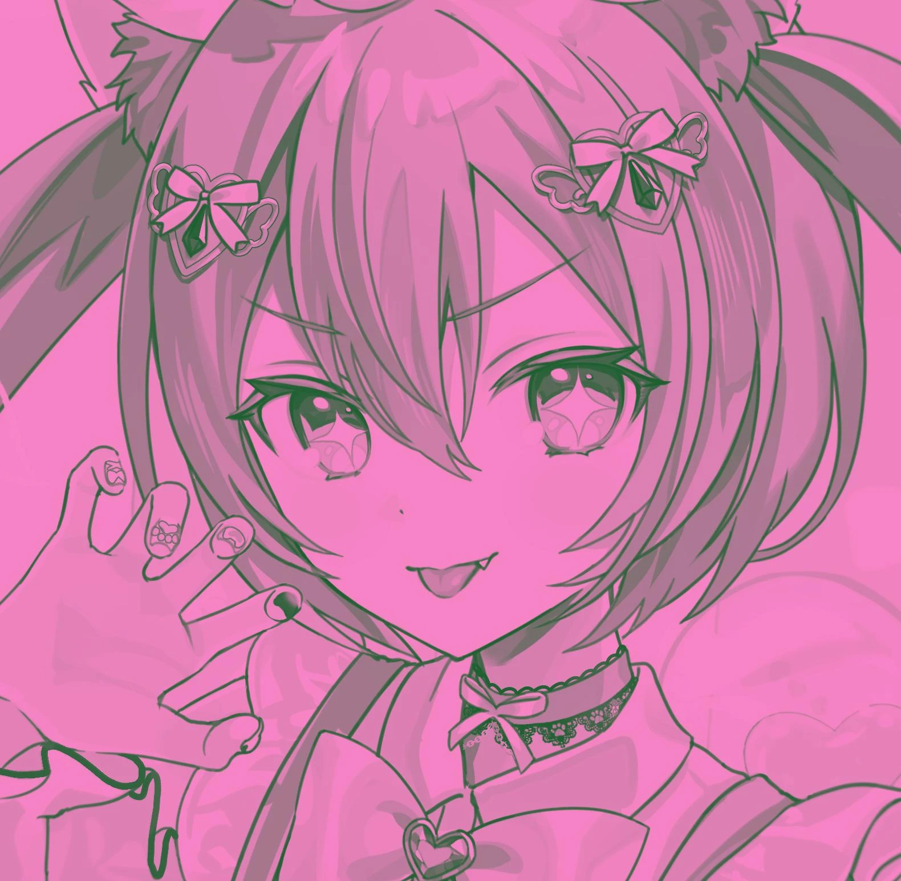 | Transform photos into artistic duotone images with customizable color schemes. Supports 4 filter modes including classic and reverse. | [Launch →](https://motebaya.github.io/cimagen/duotone-creator) |
| **Metadata Viewer** | 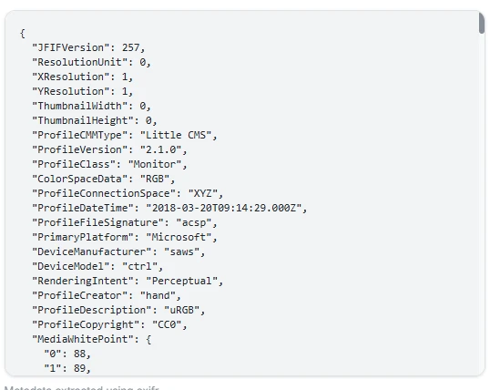 | Extract and view EXIF data, camera settings, GPS location, and technical details from photos. | [Launch →](https://motebaya.github.io/cimagen/metadata-viewer) |
| **BLACKPINK Logo Maker** | 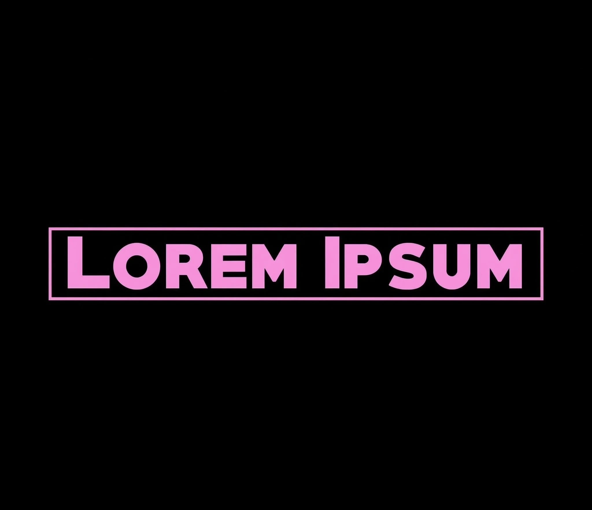 | Create K-pop style logos with signature pink and black aesthetics inspired by BLACKPINK. | [Launch →](https://motebaya.github.io/cimagen/blackpink-creator) |
| **GTA Wasted Effect** |  | Add the iconic GTA "Wasted" game over effect to your images. Perfect for memes and gaming content. | [Launch →](https://motebaya.github.io/cimagen/wasted-creator) |
| **PH Logo Style Generator** | 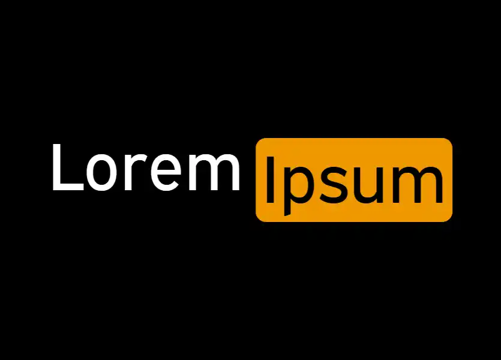 | Generate logos in the iconic orange and black style with customizable text and colors. | [Launch →](https://motebaya.github.io/cimagen/phlogo-creator) |
| **Handwritten Text Generator** |  | Create realistic handwritten text on paper. Generate authentic-looking notes and messages digitally. | [Launch →](https://motebaya.github.io/cimagen/paper-writer-creator) |
| **Pokemon Card Creator** | 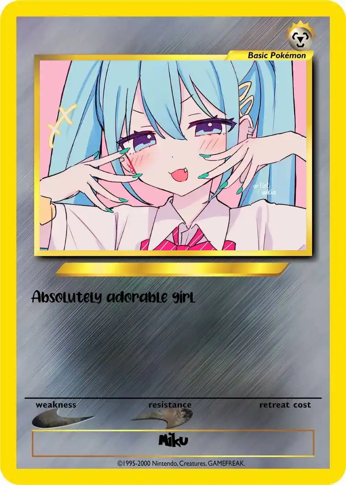 | Design custom Pokemon trading cards with personalized stats, images, and abilities. | [Launch →](https://motebaya.github.io/cimagen/pokemon-card-creator) |
| **ICO Converter** | 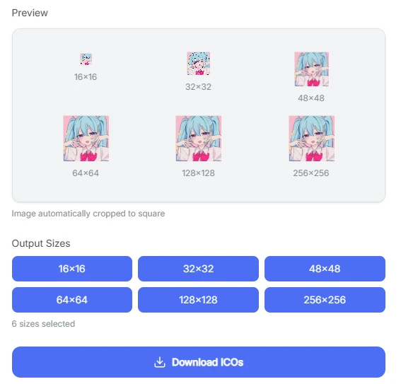 | Convert images to ICO format for favicons and Windows icons. Generates multiple sizes (16×16 to 256×256). | [Launch →](https://motebaya.github.io/cimagen/ico-converter) |
| **PDF Converter** | 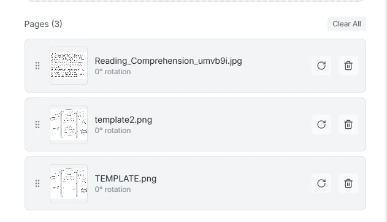 | Convert multiple images to PDF documents. Combine images into a single PDF with customizable layout. | [Launch →](https://motebaya.github.io/cimagen/pdf-converter) |
| **SVG Converter** | 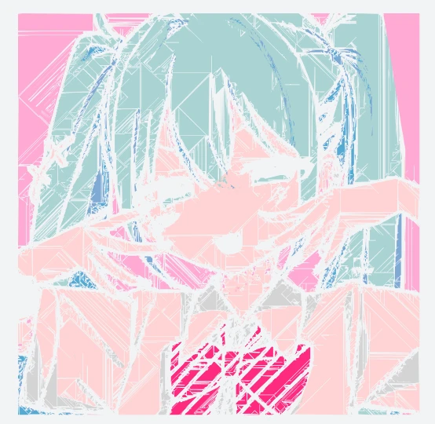 | Transform raster images into scalable SVG vector graphics. Create resolution-independent graphics. | [Launch →](https://motebaya.github.io/cimagen/svg-converter) |
| **Low-Res Generator** |  | Simulate low-resolution images with realistic degradation effects. Create pixelated and compressed versions. | [Launch →](https://motebaya.github.io/cimagen/lowres-generator) |
| **OCR Reader** | 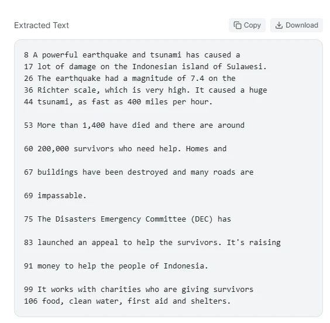 | Extract text from images using advanced OCR technology. Convert image text to editable text in multiple languages. | [Launch →](https://motebaya.github.io/cimagen/ocr-reader) |
| **App Icon Generator** | 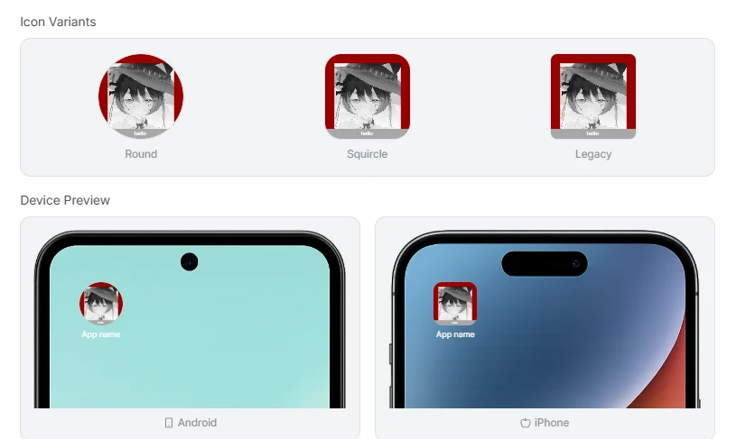 | Generate Android and iOS app icons with proper directory structure. Includes adaptive icons, round icons, and all required sizes in a single ZIP file. | [Launch →](https://motebaya.github.io/cimagen/app-icon-generator) |

---

## 🚀 Key Features

### Privacy First
- **100% Client-Side Processing** — All operations run in your browser
- **No Server Uploads** — Your images never leave your device
- **No Data Collection** — Complete privacy and security

### Professional Tools
- **Multiple Export Formats** — PNG, JPG, WEBP with configurable quality
- **Live Preview** — Real-time preview with debounced updates
- **Batch Processing** — Handle multiple images efficiently
- **High Resolution** — Maintains original image quality

### User Experience
- **Edit History** — localStorage-backed history (up to 20 entries per tool)
- **Dark/Light Theme** — Persistent theme toggle with smooth transitions
- **Responsive Design** — Works seamlessly on desktop and mobile
- **Lazy Loading** — Optimized performance with IntersectionObserver
- **Font Preloading** — Custom fonts loaded on app initialization

---

## 🛠️ Tech Stack

| Layer | Technology |
|-------|------------|
| **Framework** | React 19 |
| **Bundler** | Vite 7 |
| **Styling** | TailwindCSS v4 |
| **Routing** | react-router-dom v7 |
| **Icons** | lucide-react |
| **Image Processing** | Native Canvas API |
| **OCR Engine** | Tesseract.js |
| **PDF Generation** | jsPDF |
| **ZIP Creation** | JSZip |
| **Font Loading** | FontFace API |
| **Deployment** | GitHub Pages via GitHub Actions |

---

## 📦 Installation

### Prerequisites

- [Node.js](https://nodejs.org/) v18 or later
- npm v9 or later

### Setup

```bash
# Clone the repository
git clone https://github.com/motebaya/cimagen.git
cd cimagen

# Install dependencies
npm install

# Start the development server
npm run dev
```

The development server starts at `http://localhost:5173/cimagen/`.

### Production Build

```bash
# Build for production
npm run build

# Preview production build locally
npm run preview
```

The optimized output is written to the `dist/` directory.

---

## 📁 Project Structure

```
cimagen/
├── public/
│   ├── images/          # Sample images and assets
│   └── fonts/           # Custom fonts
├── src/
│   ├── components/      # Reusable React components
│   ├── pages/           # Feature pages
│   ├── utils/           # Utility functions
│   ├── config/          # Configuration files
│   ├── App.jsx          # Main app component
│   └── main.jsx         # Entry point
├── scripts/
│   └── generateSEO.js   # SEO meta tag generator
└── vite.config.js       # Vite configuration
```

---

## 🎯 Feature Details

### Duotone Creator Modes

| Mode | Description |
|------|-------------|
| **Original** | Optimized shadow/highlight preset |
| **Classic** | Classic green/pink color palette |
| **Reverse** | Swapped shadow ↔ highlight (optimized) |
| **Classic & Reverse** | Swapped shadow ↔ highlight (classic) |

### App Icon Generator Output

Generates a complete ZIP file with:
- **Android Icons**: All mipmap densities (ldpi, mdpi, hdpi, xhdpi, xxhdpi, xxxhdpi)
- **Adaptive Icons**: Foreground and background layers with XML configuration
- **iOS Icons**: Complete AppIcon.appiconset with all required sizes
- **Additional Formats**: Play Store icon, web icon, iTunes artwork

---

## 🌐 Browser Support

- Chrome/Edge 90+
- Firefox 88+
- Safari 14+
- Opera 76+

---

## 🤝 Contributing

Contributions are welcome! Please feel free to submit a Pull Request.

1. Fork the repository
2. Create your feature branch (`git checkout -b feature/AmazingFeature`)
3. Commit your changes (`git commit -m 'Add some AmazingFeature'`)
4. Push to the branch (`git push origin feature/AmazingFeature`)
5. Open a Pull Request

---

## 📄 License

This project is licensed under the MIT License - see the [LICENSE](LICENSE) file for details.

---

## 🙏 Acknowledgments

- Icons by [Lucide](https://lucide.dev/)
- OCR powered by [Tesseract.js](https://tesseract.projectnaptha.com/)
- Fonts: Inter, Space Grotesk, Helvetica LT Std

---

Made with 🍵 by [motebaya](https://github.com/motebaya)
